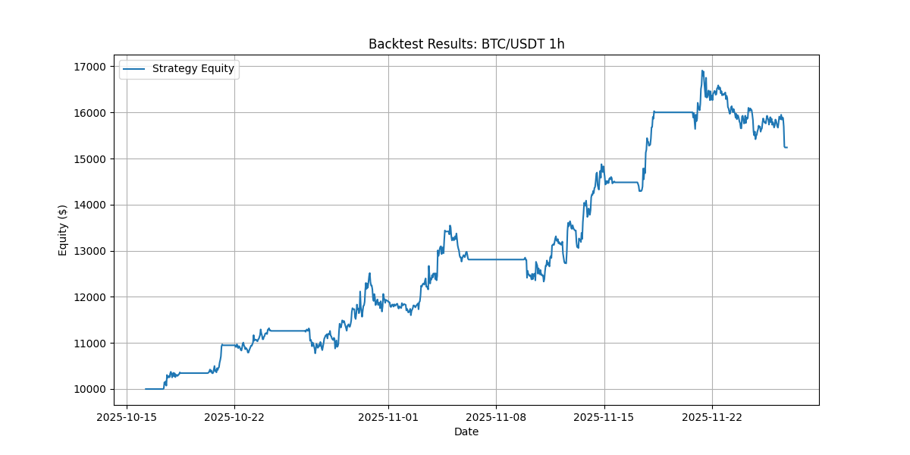

# 4-Layer Quant Trading Strategy

## Overview
This project implements a comprehensive quantitative trading strategy for Bitcoin, structured in 4 layers:
1.  **Regime Detection**: Identifies market state (Trend vs Mean Reversion).
2.  **Signal Filtering**: Uses Order Book Imbalance and Meta-labeling to filter signals.
3.  **Risk Management**: Applies Volatility Targeting and Max Drawdown guardrails.
4.  **Execution**: Simulates Smart Order Routing and Algo Execution (TWAP/POV).

## Project Structure
-   data/: Data fetching and storage.
-   strategy/: Indicators and regime logic.
-   ilters/: Signal filtering logic.
-   
isk/: Position sizing and risk controls.
-   execution/: Order routing and execution algorithms.
-   nalysis/: Statistical tests and backtesting.
-   	ests/: Unit tests.
-   config.yaml: Strategy and backtest configuration.

## Installation
1.  Create a virtual environment:
    `ash
    python -m venv venv
    .\venv\Scripts\activate
    `
2.  Install dependencies:
    `ash
    pip install -r requirements.txt
    `
3.  Configure API Keys (Optional for real data):
    -   Rename .env.example to .env (if exists) or create one.
    -   Add BINANCE_API_KEY and BINANCE_SECRET.

## Configuration
The strategy parameters are defined in config.yaml. You can adjust:
-   **Indicators**: MA windows, RSI thresholds, BB settings.
-   **Risk**: Stop Loss / Take Profit multipliers (ATR based), Max Drawdown.
-   **Backtest**: Symbol, timeframe, initial capital.

## Usage
### Run Backtest
`ash
python run_backtest.py
`
This will fetch data (or use mock), run the strategy, and generate a performance plot acktest_result_config.png.

### Run System Pipeline Test
`ash
python main.py
`

## Backtest Results

*Note: The above graph shows the equity curve from a simulation run.*

## Modules
-   **Indicators**: Donchian, MA, RSI, BB, ATR, GARCH.
-   **Filters**: Order Book Imbalance, Random Forest Meta-labeling.
-   **Risk**: Volatility Targeting, Monte Carlo Simulation.
-   **Analysis**: Permutation Tests, Trade Dependence.

## Disclaimer
This is a research project. Real trading involves significant risk. The execution layer is currently a simulation.
